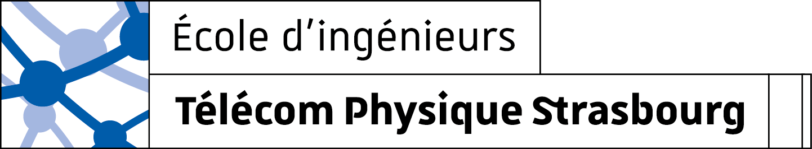
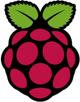
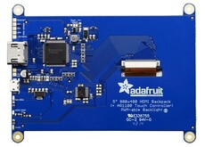
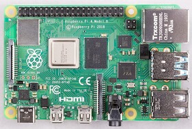
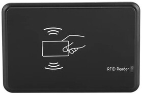
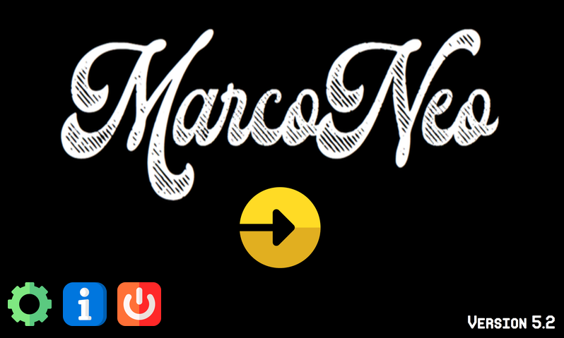
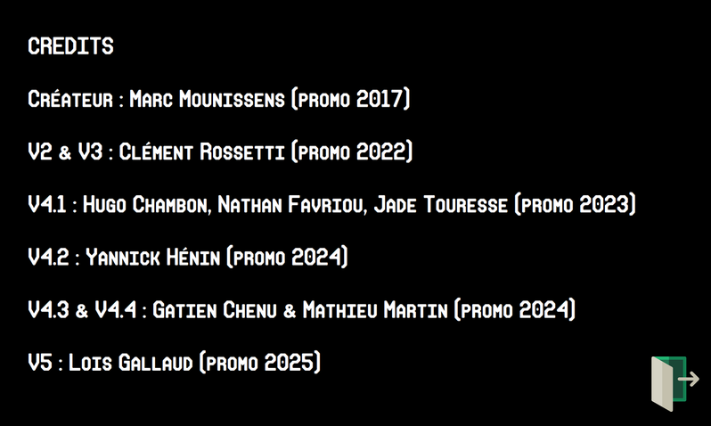
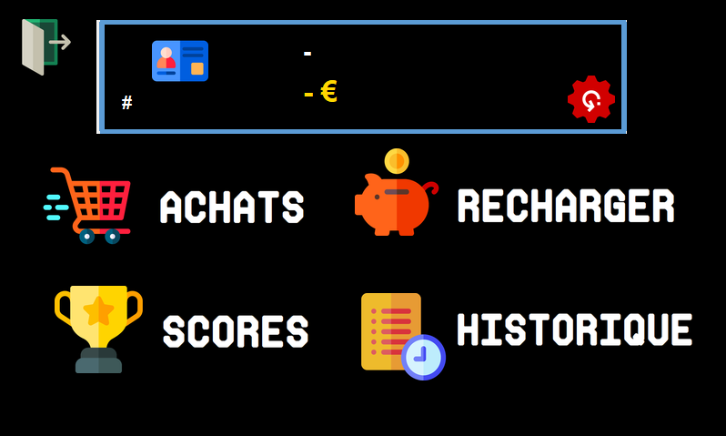
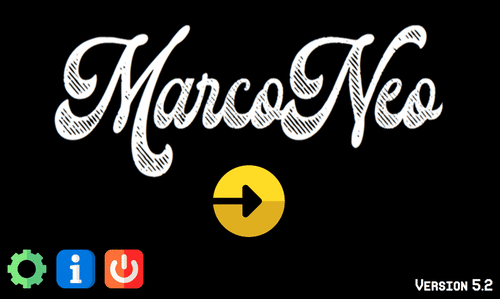
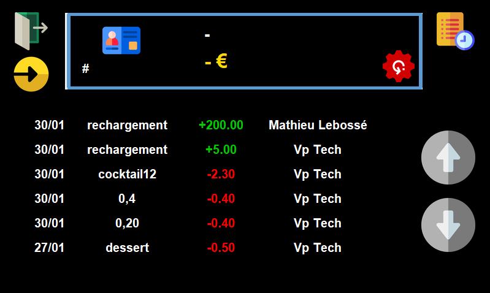

# **MARCONEO**



---

La **Marconeo** est une machine utilisée par les responsables du foyer étudiant (appelés Fouailles) pour faire payer les cotisants au BDE.


On peut la trouver sous la forme d'une boîte avec un écran tactile.
Cette boîte est souvent nommée "**Marco**" pour les étudiants de [Télécom Physique Strasbourg](https://www.telecom-physique.fr) (abrégé en TPS).

---
<div id="avant-propos">

## ***AVANT-PROPOS***

Ce fichier README a pour but d'aider les prochaines générations de VP Tech ainsi que tous ceux qui veulent s'intéresser à la Marco.

>Son contenu n'est pas fixe et je lui souhaite d'être en constante évolution.

Veuillez noter que lors de l'écriture de ce README, le projet Marconeo était loin d'être abouti. Cela veut donc dire que de nombreuses informations ont dû être prises en compte en cours de route sans vraiment comprendre leur raison d'être.
</div>

---

<div id="table-des-matieres">

## **TABLE DES MATIERES**

- [**AVANT-PROPOS**](#avant-propos)
- [**TABLE DES MATIERES**](#table-des-matieres)
- [**INTRODUCTION**](#introduction)
    - [Qu'est ce que la Marco?](#quest-ce-que-la-marco)
    - [A quoi sert la Marco?](#a-quoi-sert-la-marco)
        - [Qu'est ce que la *Carte Fouaille*?](#quest-ce-que-la-carte-fouaille)
        - [Que se passe-t-il si *je perds* ma Carte Fouaille?](#que-se-passe-t-il-si-je-perds-ma-carte-fouaille)
- [**BASE DE DONNEES**](#base-de-donnees)
    - [Comment *accéder* à la base de données?](#comment-acceder-a-la-base-de-donnees)
    - [Ancienne Base de Données](#ancienne-base-de-donnees)
    - [Nouvelle Base de Données](#nouvelle-base-de-donnees)
- [**COMPOSANTS**](#composants)
    - [Ancienne Marco](#ancienne-marco)
    - [Nouvelle Marco](#nouvelle-marco)
- [**APPLICATION MARCONEO**](#application-marconeo)

- [**INSTALLATION**](#installation)
    - [Prérequis](#prerequis)
    - [Installation de la Marco](#installation-marco)
    <!-- - [**Installation de la Base de Données**](#installation-de-la-base-de-donnees) -->
<!-- - [**UTILISATION**](#utilisation)
- [**Utilisation de la Marco**](#utilisation-de-la-marco) -->
</div>

---

<div id="introduction">

## **INTRODUCTION**

<div id="qu-est-ce-que-la-marco">

### **Qu'est ce que la Marco?**

La Marco est le projet ingénieur d'un ancien étudiant de TPS. Au fur et à mesure que les années passent, certains autres étudiants s'y sont intéressé pour l'améliorer ou bien la réparer suite à des dégradations (voir [VERSIONS](#versions) de la Marco). Une boîte a été imprimée en 3D pour pouvoir y contenir les composants nécessaires à son fonctionnement. Son programme est stocké dans une Raspberry pi à l'intérieur de la boîte et fait fonctionner une interface graphique sur l'écran lorsque la Marco est alimentée. Il suffit pour les Fouailles de scanner les Cartes Fouaille des étudiants devant la Marco pour pouvoir en intéragissant avec l'interface graphique sur l'écran déduire de l'argent sur leur solde.

</div>
<div id="a-quoi-sert-la-marco">

### **A quoi sert la Marco?**

Elle permet au BDE **d'opérer des transactions par carte fouaille de manière instantanée**. L'application étant reliée à la base de donnée du BDE, elle permet aux Fouailles et au Trésorier de tenir les comptes du BDE.
Elle peut également servir aux cotisants de consulter **leur solde** (contenu sur leur carte fouaille) et **leur historique d'achats**.

>#### Qu'est ce que la *Carte Fouaille*?

Il s'agit d'une carte en plastique magnétisée qui sert de cagnotte pour les cotisants. Elle leur est remise lors de l'adhésion au BDE en début d'année. Cette carte contient un numéro unique, pouvant être détecté par le capteur RFID de la Marco (principe de la [radio-identification](https://fr.wikipedia.org/wiki/Radio-identification))
Après avoir été branché en USB au PC, le capteur RFID fonctionne comme un clavier: c'est à dire que lorsqu'une carte est passée devant le capteur, le PC reçoit l'ordre d'écrire des caractères.
Chaque numéro sur les Cartes Fouailles vont de 0 à 10 chiffres mais une Carte Fouaille est **unique**. Si vous la perdez vous ne pourrez plus consommer et utiliser votre solde.

>#### Que se passe-t-il si *je perds* ma Carte Fouaille?

Les cotisants qui perdent leur Carte Fouaille peuvent venir voir le VP Tech du BDE pour qu'il migre ses informations de cotisant sur le badge magnétique donné par la scolarité en début d'année.

<details>
        <summary>
            <b>
                Voir comment faire
            </b>
        </summary>

- #### **Matériel**

    - Ordinateur avec un clavier qwerty
    - Capteur RFID
    - Connexion à la base de donnée du BDE

- #### **Processus**

    Il suffit d'écrire dans la colonne numero_carte du cotisant que le Tech dépanne: passer le badge magnétique devant le capteur branché en USB écrira le nouveau numéro dans la base de donnée.
    Ainsi, la Carte Fouaille est désactivée et le badge remplace désormais la carte perdue.
</details>
</div>
</div>

---
---
<div id="base-de-donnees">


## **BASE DE DONNÉES**

La base de données du BDE recense toutes les informations concernant les cotisants au BDE ainsi qu'un historique de toutes commandes passées par les fouailles sur la Marco.

<div id="comment-acceder-a-la-base-de-donnees">

>### Comment *accéder* à la base de données?

<!-- Il suffit de se rendre sur https://phpmyadmin.com -->

</div>

---

<div id="ancienne-base-de-donnees">

### **Ancienne Base de Données**

**Ancienne Architecture :**

- ***Cotisants***

    |id|numero_carte|nom|prenom|surnom|mail|promo|admin|note|objet|
    |:---:|:---:|:---:|:---:|:---:|:---:|:---:|:---:|:---:|:---:|
    |smallint(5)|bigint(10)|varchar(50)|varchar(60)|varchar(30)|varchar(120)|smallint(6)|tinyint(1)|decimal(10,2)|varchar(60)|

- ***Commande***

    |id|numero_carte|nom|prenom|old_note|new_note|delta|type_produit|produit|date_histo|utilisateur_histo|amount|
    |:---:|:---:|:---:|:---:|:---:|:---:|:---:|:---:|:---:|:---:|:---:|:---:|
    |bigint(20)|bigint(20)|varchar(50)|varchar(60)|decimal(10, 2)|decimal(10, 2)|decimal(10, 2)|varchar(30)|text|datetime(6)|varchar(20)|int(11)|

- ***Produits***

    |id|nom|prix|type|
    |:---:|:---:|:---:|:---:|
    |int(11)|text|float|int(11)|

**Commentaires :**

L'ancienne base de données contient des colonnes incorrectement utilisées:

- Des colonnes comme "nom" et "prenom" sont utilisées à la fois dans la table Cotisant et Commande.
- L'existence d'une colonne "new_note" est remise en question par la présence d'une colonne "delta".
- On ne sait pas vraiment ce que la colonne "objet" devait contenir.
- L'utilisation de la table Produit serait meilleure avec un autre type de service. Cela est cependant encore discutable.
</div>

---

<div id="nouvelle-base-de-donnees">

### **Nouvelle Base de Données**

#### **Nouvelle Architecture :**

- ***Cotisants***

    |id|numero_carte|nom|prenom|surnom|mail|promo|filiere|isCotisant|anniversaire|droit_image|solde|admin|
    |:---:|:---:|:---:|:---:|:---:|:---:|:---:|:---:|:---:|:---:|:---:|:---:|:---:|

- ***Commande***

    |id|delta|type_produit|produit|date|amount|
    |:---:|:---:|:---:|:---:|:---:|:---:|

#### **Objectifs :**

- Détailler un maximum l'identité du cotisant au BDE. Ce choix doit respecter certaines clauses imposées par le RGPD.
- Ne pas surcharger la table Commande, qui est déjà remplie régulièrement par des centaines de commandes: il faut aller au plus simple et réduire la quantité d'informations.
</div>

---
---

</div>

</div>
<div id="composants">



## **COMPOSANTS**

Il s'agit pour l'instant d'une boîte contenant une carte Raspberry Pi, un écran LCD et un capteur RFID.

---

<div id="composants">
<div id="ancienne-marco">

### ***Ancienne Marco :***

- **Écran :**
800x480 HDMI Backpack (AR1100 touch controller) PWM-able backlight

- **Microcontrôleur :**
Raspberry Pi 4 Model B

- **Capteur RFID :**
Lecteur RFID 125kHz compatible Windows

||||
|:---:|:---:|:---:|
|Écran|Raspberry Pi|Lecteur RFID|

</div>
</div>

<div id="nouvelle-marco">

### ***Nouvelle Marco :***

<!-- - **Écran :**
7" LCD Touchscreen (800x480) HDMI

- **Microcontrôleur :**
Raspberry Pi 4 Model B

- **Capteur RFID :**
Lecteur RFID 125kHz compatible Windows -->

> ajouter screen SolidWorks

</div>

---

<div id="application">


## **APPLICATION MARCONEO**

L'application Marconeo est codée en Python et construite selon une architecture logique facile de compréhension. Elle est divisée en 4 parties:
- [Achats](#achats)
- [Rechargements](#rechargements)
- [Historique](#historique)
- [Scores](#scores)

---

<div id="menu-principal">

- ***Menu principal :***

    Le menu principal présente le nom du projet avec un bouton central pour entrer dans la Marco.
    Il y également trois boutons en bas à gauche de l'écran:
    - [Paramètres](#parametres)
    - [Crédits](#credits)
    - [Quitter](#quitter)

    
</div>
<div id="parametres">

- ***Paramètres :***

    Le menu paramètres permet à l'utilisateur de modifier les paramètres de la Marco.

    <!---->
</div>
<div id="credits">

- ***Crédits :***

    Le menu crédits permet à l'utilisateur de voir les différents contributeurs au projet.

    
</div>

<div id="quitter">

- ***Quitter :***

    Le menu quitter permet à l'utilisateur de quitter l'application. C'est un menu qui sert de garde-fou au cas où l'utilisateur ferait une mauvaise manipulation.
    Il est préférable d'éteindre la Marco avec ce bouton plutôt que de la débrancher car les déconnexions aux serveurs se font proprement en plus de prendre soin du matériel.
    >Auparavant, les fouailles étaient habitués à défibriller la Marco en la débranchant dès qu'ils avaient un soucis. Cela avait pour conséquence de laisser la Marco dans un état instable et de dégrader la [raspberry pi](#composants) à l'intérieur.

    <!--  -->
</div>
<div id="choix">

- ***Choix :***

    Une fois que l'utilisateur a entré dans la Marco, il doit choisir entre les différents menus disponibles. Il peut choisir entre les achats, les rechargements, l'historique et le tableau des scores.

    
</div>
<div id="achats">

- ***Achats :***

    Dans un des menus prévus à cette effet, l'utilisateur a face à lui différents articles disponibles. Il peut en cliquant sur l'image de l'article souhaité ajouter une quantité supplémentaire dans son panier.
    Une fois qu'il souhaite payer sa commande, il doit cliquer sur le bouton "confirmer" en bas à droite de l'écran.
    Une nouvelle fenêtre s'ouvre: la validation de la commande. S'il le souhaite, il peut toujours faire marche-arrière et annuler sa commande. S'il annule la commande, la page reviendra sur le menu d'achat avec les différents articles disponibles. Sinon, le montant est déduit.

    
</div>
<div id="rechargements">

- ***Rechargements :***

    Dans le menu rechargement, l'utilisateur peut choisir le montant qu'il veut recharger sur sa carte fouaille en appuyant sur les boutons. Une fois le montant saisi, il doit scanner une carte fouaille avec des droits admin (les Fouailles ou le Prez) pour pouvoir valider le rechargement de carte fouaille. Une fois la carte admin scannée et reconnue par la Marco, il suffit d'appuyer sur le bouton entrer pour pouvoir procéder à la validation de rechargement.

    
</div>
<div id="historique">

- ***Historique :***

    Dans le menu historique, l'utilisateur peut voir l'historique de ses achats et de ses rechargements. Il peut aussi voir le solde de sa carte fouaille.

    
</div>
<div id="scores">

- ***Scores :***

    Dans le menu scores, l'utilisateur peut voir le classement des utilisateurs de la Marco. Il peut aussi voir le solde de sa carte fouaille.

    <!--  -->
</div>
</div>

---

<div id="installation">


## **INSTALLATION**

<div id="prerequis">

### **Prérequis**

Vous aurez besoin de [Docker](https://docs.docker.com/get-docker/). Allez sur leur site pour télécharger Docker. puis verifiez que Docker est bien installé en tapant la commande suivante dans un terminal:

```bash
docker --version
```

Si vous avez une erreur, c'est que **Docker n'est pas installé**. Si vous avez une version de Docker, c'est que vous êtes **prêt** à continuer.

Grâce à Docker, vous n'aurez pas besoin d'installer Python sur votre machine. Vous n'aurez qu'à suivre les prochaines étapes.

</div>
<div id="installation-marco">

### **Installation de la Marco**

1. Télécharger l'archive du projet sur le [dépôt GitHub](https://github.com/LOISGALLAUD/MarcoNeo)
2. Décompresser l'archive
3. Ouvrir un terminal dans le dossier décompressé
4. Executer les commandes suivantes:

    ```bash
    docker build -t marconeo .
    docker run -it marconeo
    ```

>Que font ces commandes?

- `docker build -t marconeo .` : Construit l'image Docker à partir du fichier `Dockerfile` présent dans le dossier courant. L'option `-t` permet de donner un nom à l'image docker. Ici, on donne le nom `marconeo` à l'image.
- `docker run -it marconeo` : Lance un conteneur à partir de l'image `marconeo`. L'option `-it` permet de lancer le conteneur en mode interactif. Cela permet de voir les logs de l'application dans le terminal. Cette commande execute le fichier `main.py` qui lance l'application.

Pour plus d'informations sur Docker, vous pouvez consulter la [documentation officielle](https://docs.docker.com/) de Docker.

</div>
</div>

---

## **FUTUR DE LA MARCO**

- La rendre portable (imagine)
- la connecter à l'app
- Paiement/Rechargement en ligne

---

## **VERSIONS**

| Version | Participants |
| ------- | ------------ |
| Créateur | Marc Mounissens (Promo 2017) |
| V0.2.0 & V0.3.0 | Clément Rossetti (Promo 2022) |
| V0.4.1 | Hugo Chambon (Fouaille BDE 2021), Nathan Favriou (Président Ensorceliste), Jade Touresse (Fouaille BDE 2021) |
| V0.4.2 | Yannick Hénin (Ext BDE 2022) |
| V0.4.3 & V0.4.4 | Gatien Chenu (Int BDE 2022), Mathieu Martin (Ext BDE 2022) |
| V0.5.0 | Loïs Gallaud (Tech Prélistoire) |

---
---

Rédigé en Février 2023 par Loïs Gallaud
